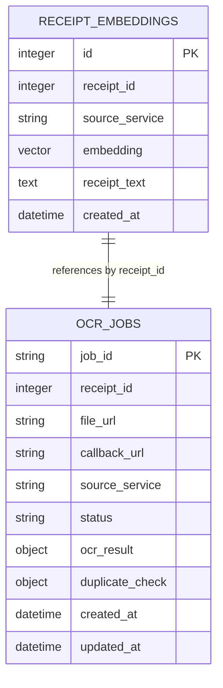

# Detailed System Design (DSD): OCR Pipeline

## 1. Database Schema Definitions
The OCR Pipeline utilizes a hybrid data layer featuring PostgreSQL (relational + vector search) and MongoDB (document metadata) for performance and flexibility.

```
                  +--------------------------------+
                  |           OCR PIPELINE         |
                  +---------------+----------------+
                                  |
         +------------------------+------------------------+
         |                                                 |
         v                                                 v
  PostgreSQL (pgvector)                                 MongoDB
  - receipt_embeddings                                  - ocr_jobs
  - Coordinates vector queries                          - Coordinates task status & OCR text
```

---

### 1.1. PostgreSQL (pgvector)
PostgreSQL is configured with the `pgvector` extension to handle semantic vector storage and execution of high-speed cosine similarity queries.

#### Table: `receipt_embeddings`
Defines the relational storage for extracted text vector representations.

| Field Name | Data Type | Nullable | Primary Key | Description |
|---|---|---|---|---|
| `id` | `Integer` | No | Yes | Auto-incrementing primary key. |
| `receipt_id` | `Integer` | No | No | References the corresponding receipt in the caller system (e.g. SERMS). |
| `source_service` | `String(50)` | No | No | Identifies the caller service (e.g., `"serms"`, `"prs"`). |
| `embedding` | `Vector(384)` | Yes | No | 384-dimensional floating point vector generated via `all-MiniLM-L6-v2`. |
| `receipt_text` | `Text` | No | No | Combined text output from PaddleOCR primary plus selected Tesseract cross-reference readings. |
| `created_at` | `DateTime(timezone=True)` | No | No | Timestamps entry creation in UTC. |

#### Indices
- **`idx_embeddings_source_service`:** Index on `source_service` column for filtering searches by origin service.
- **`idx_embeddings_created_at`:** Index on `created_at` column to facilitate 90-day time window cutoffs.
- **`idx_embeddings_vector` (HNSW/IVFFlat):** Optional index applied to the `embedding` column for accelerating cosine similarity queries on larger datasets.

---

### 1.2. MongoDB
MongoDB stores asynchronous job logs, raw confidence scores, and structured OCR extraction data.

#### Collection: `ocr_jobs`
Stores complete metadata payloads.

##### JSON Schema:
```json
{
  "_id": "ObjectId",
  "job_id": "string (UUID v4, unique)",
  "receipt_id": "integer",
  "file_url": "string (URL)",
  "callback_url": "string (URL)",
  "source_service": "string",
  "status": "string (queued | processing | completed | failed)",
  "created_at": "ISODate",
  "updated_at": "ISODate",
  "error_message": "string (optional)",
  "ocr_result": {
    "vendor_name": "string",
    "transaction_date": "string (YYYY-MM-DD)",
    "total_amount": "double",
    "vat_amount": "double",
    "tin": "string",
    "invoice_number": "string",
    "confidence_score": "double",
    "line_items": [
      {
        "item_name": "string",
        "quantity": "integer",
        "total_price": "double"
      }
    ]
  },
  "duplicate_check": {
    "is_duplicate": "boolean",
    "similarity_score": "double (optional)",
    "matches_count": "integer"
  }
}
```

#### Indices
- **`job_id`:** Unique ascending index for fast single-job queries.
- **`receipt_id`:** Ascending index to fetch jobs associated with specific receipts.
- **`created_at`:** TTL index (optional) if automatic raw payload deletion policies are established.

---

### 1.3. Redis Cache Namespaces
Redis is utilized as Celery's message broker and as a light caching layer for quick duplicate matching.

- **Celery Queues:** Standard Celery broker keys (`celery`, `celery-task-meta-*`).
- **File Hashing Cache:** 
  - **Key Structure:** `ocr:file_hash:<sha256_hash>`
  - **Value:** `job_id` (string)
  - **TTL:** 90 Days
  - **Purpose:** If a matching file hash is submitted, bypass background worker OCR execution entirely and reuse the existing job metadata.

---

## 2. Entity Relationship Diagram (ERD)
The logical mapping of the database entries between PostgreSQL and MongoDB is represented below:



---

## 3. Migrations & Seed Data Plan
- **PostgreSQL Migrations:** Managed using **Alembic**. Schema changes and index updates must be scripted under `alembic/versions` and run via `alembic upgrade head`.
- **MongoDB Initialization:** Schemas are resolved dynamically. Collections and indices (e.g. unique constraint on `job_id`) are created programmatically during application lifespan startup (`lifespan` in `app/main.py`).
- **Seed Data:** Pytest suites load mock vector arrays and dummy receipt structures into local test databases on-the-fly and tear them down during test teardown.

## 1.3 Financial semantics audit data
The `ocr_jobs` document may contain `financial_semantics` and an expanded `reconciliation` object. The latter retains `tax_basis`, `financial_reconciliation_status`, `reported_total`, `computed_total`, `discrepancy`, `needs_manual_review`, and each genuine tax line in `tax_breakdown`; charges and discounts remain separate fields. Multiple tax labels are aggregated only when the existing geometry scanner identifies them as tax lines. Ambiguous or unsupported cases abstain rather than infer a total.

The extracted result also carries the optional callback fields `tax_basis`, `financial_reconciliation_status`, and `needs_manual_review`; legacy callback fields are preserved.
