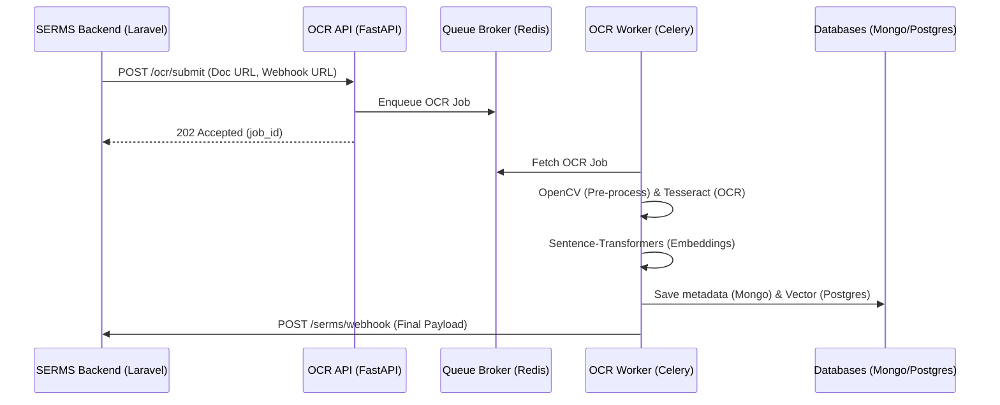

# Software Architecture Document (SAD): OCR Pipeline for SERMS

## 1. Architectural Overview
The OCR Pipeline is designed as an asynchronous, microservice-based architecture to process document extraction tasks out-of-band from the main SERMS application. 

### High-Level Design Pattern
- **API Gateway / Entrypoint:** FastAPI provides a lightweight, high-performance REST API layer.
- **Asynchronous Task Queue:** Celery workers manage the heavy processing (OpenCV, PaddleOCR, PyTesseract, sentence-transformers, Ollama).
- **Message Broker:** Redis coordinates task queue state and acts as a caching layer.
- **Data Persistence:** 
  - **MongoDB:** Stores unstructured document extraction outputs, task statuses, and processing logs.
  - **PostgreSQL (pgvector):** Stores and queries semantic document embeddings for similarity checks.

---

## 2. Technology Stack
| Layer | Tech Choice | Justification & Trade-offs |
|---|---|---|
| **API Framework** | FastAPI (Python 3.12+) | Highly performant, native async support, and auto-generated OpenAPI documentation. |
| **Worker Engine** | Celery + Redis | Industry standard for Python background tasks; manages concurrency and retries reliably. |
| **OCR Processing** | PyTesseract & OpenCV | OpenCV cleans/pre-processes images (deskewing, binarization) to optimize Tesseract's printed-text recognition accuracy. |
| **Vector Database** | PostgreSQL + pgvector | Avoids introducing a separate specialized vector DB; allows query caching and seamless relational storage of metadata. |
| **NoSQL Database** | MongoDB | Stores raw extracted text, complex line-items tables, and dynamic metadata without schema lock-in. |
| **Local LLM** | Ollama (Qwen2.5:1.5b) | Handles advanced parsing, fallback corrections, and extraction formatting locally without external API costs. |

---

## 3. Component Communication
The main SERMS application (Laravel) communicates with this microservice via simple REST API call mechanisms:
1. **Request Submission:** Laravel sends a synchronous `POST /ocr/submit` request containing the document URL and callback endpoint. FastAPI immediately returns a `202 Accepted` response with a `job_id`.
2. **Result Delivery:** Once processing concludes, the Celery worker triggers an HTTP webhook callback `POST /serms/webhook` to transmit the final OCR results, confidence ratings, and duplicate flags.

---

## 4. Quality Attributes & Performance Patterns
- **Concurrency Throttling:** Celery worker concurrency is strictly capped (throttled) via configuration to prevent CPU starvation on OCR/embedding generations.
- **Redis Document Caching:** Before spinning up OCR workers, Redis hashes incoming files (MD5). If a matching file hash is found with completed results, the system retrieves it from cache, bypassing CPU-intensive OCR tasks entirely.
- **Retry Mechanism:** Failed webhook deliveries are queued with exponential backoff (e.g., 10s, 30s, 60s) up to 3 retries.

---

## 5. Development & Agentic Orchestration (Merged Roster)
To enforce quality, compliance, and architectural boundaries in development, the repository uses specialized Antigravity subagents.

### The Subagent Roster
| Agent ID | Name | Role | Spawn Trigger |
|---|---|---|---|
| SAD-A1 | `laravel-endpoint-builder` | Scaffolds Laravel 13 backend controllers, migrations, and queues. | Backend task initiation. |
| SAD-A2 | `vue-component-scaffolder` | Scaffolds Vue 3 SPA frontend components. | Frontend task initiation. |
| SAD-A3 | `serms-compliance-auditor` | Audit and enforce immutable logs, RBAC, and BIR logic. | On backend component diffs. |
| SAD-A4 | `reusability-auditor` | Audit and enforce the A-09 "Reuse Before You Write" axiom. | On any component diffs. |

### Materialization (Platform Mapping)
- **Antigravity:** Prompts and guidelines located in `.agents/subagents/`.
- **Claude Code:** Prompts located in `.claude/agents/*.md`.
