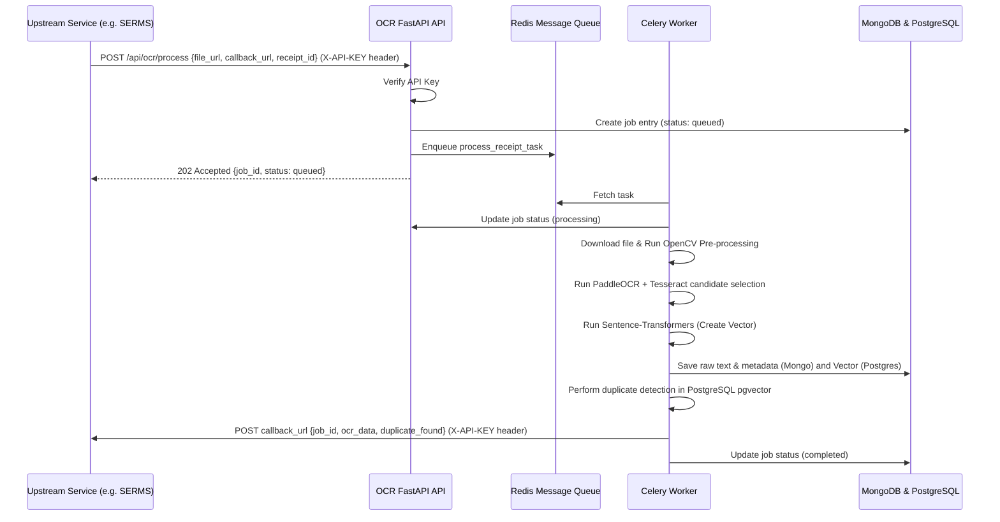

# System Design Document (SDD): OCR Pipeline

## 1. System Components & Subsystems
The OCR Pipeline is structured into three primary subsystems that handle requests, manage background workers, and store data asynchronously.

```
+--------------------------------------------------------+
|                      OCR Pipeline                      |
+------------------+------------------+------------------+
|   1. API Layer   |   2. Task Queue  |  3. Data Layer   |
|     FastAPI      |   Celery Workers | MongoDB/Postgres |
+------------------+------------------+------------------+
```

### 1.1. API Gateway / Router Layer (FastAPI)
Acts as the entry point for all service-to-service communication. Exposes endpoints for scheduling OCR jobs, checking duplicate status, and tracking long-running tasks.
- **`/api/ocr/process` (POST):** Receives file URLs and webhook callback metadata; validates the request, generates a `job_id`, updates MongoDB status to `queued`, and dispatches a Celery task.
- **`/api/duplicate-check` (POST):** Synchronously accepts text or metadata to check for duplicates in the pgvector database.
- **`/api/jobs/{job_id}/status` (GET):** Reads MongoDB to check current job processing state (`queued`, `processing`, `completed`, `failed`).
- **`/health` (GET):** Checks availability of Redis, PostgreSQL, and MongoDB.
- **`/metrics` (GET):** Exposes Prometheus/Application-level metrics.

### 1.2. Asynchronous Processing Worker Layer (Celery)
Consists of dedicated background workers running Celery to isolate heavy CPU/Memory operations.
- **`process_receipt_task`:** 
  1. Downloads document from S3/Supabase.
  2. Applies OpenCV filters (e.g., adaptive thresholding, deskewing).
  3. **Fast path (early exit):** runs a single cheap Tesseract pass over the preprocessed image (`read_fast`, PSM 6). If the reading's receipt-aware anchor score clears `FAST_PATH_ANCHOR_SCORE` (6.0), extraction runs against this single pass; when the money reconciles AND a total is present (`fast_path_sufficient`), the receipt ships immediately — skipping the multi-pass pool entirely. When the first pass scores below the threshold, a second cheap pass (`read_fast_fallback`) over the `flat` rendering at PSM 11 gets one more try before the pool, rescuing clean receipts whose best-effort rendering degrades (e.g. deskew/denoise hurting that particular image). Otherwise the worker **escalates**: PaddleOCR and the full Tesseract variant × PSM pool run concurrently, selecting the strongest reading by anchor scoring while retaining all candidates for amount/item reconciliation; failed engines degrade independently. Tall/narrow receipts (aspect ≥ 2.0, e.g. long grocery POS slips) get `text_det_limit_side_len=512` in `read_paddle` — measured ~30% faster with identical line/character output (the default 960px limit blows the internal image up to ~3820px). Supporting readings scoring below `primary.score / 2.0` are dropped from `combined_text` so Tesseract garbage never pollutes the LLM prompt. Item parsing handles price-first grocery layouts (`64.00 V` / `1 × 64.00` / barcode + store code) via a pending-item mechanism, and store-code names (uppercase + mixed alphanumeric tokens like `EP025G`) are kept verbatim — exempt from dictionary and LLM normalization.
  4. Generates a 384-dimensional semantic embedding via `sentence-transformers` (`all-MiniLM-L6-v2`) — computed **once** per job and reused for both duplicate detection and pgvector storage.
  5. Stores raw text, confidence, and metadata in MongoDB.
  6. Inserts the embedding vector into PostgreSQL.
  7. Performs a duplicate lookup via pgvector.
  8. Triggers the callback webhook to post results back to the caller.

### 1.3. Persistence & Cache Layer
- **Redis:** Message broker for Celery and caching layer for file hashes.
- **MongoDB:** Flexible metadata storage. No relational constraints, allowing arbitrary line items, confidence scores, and raw OCR outputs to be stored as a single document.
- **PostgreSQL (with pgvector):** Primary relational engine storing document embeddings and executing cosine similarity queries.

---

## 2. Data Flow & Integration Points

### 2.1. Ingestion & Processing Data Flow
The sequence diagram below represents the end-to-end lifecycle of a receipt upload and OCR processing workflow:



### 2.2. Authentication & Security
- **Service-to-Service Authentication:** All REST API endpoints require a pre-shared API Key passed in the `X-API-KEY` HTTP header. 
- **Webhook Security:** Outbound webhook callbacks sent from the Celery workers to the upstream caller also attach the `X-API-KEY` header to authenticate the payload on the receiver's end.
- **CORS Settings:** No CORS configuration is exposed or permitted because this service is solely accessed backend-to-backend. No browser clients communicate directly with the OCR Pipeline.

---

## 3. Configuration & Environment
The microservice is configured using environment variables loaded at runtime via Pydantic Settings.

| Variable | Type | Default | Description |
|---|---|---|---|
| `APP_NAME` | string | `ocr-pipeline` | Name of the service. |
| `APP_ENV` | string | `development` | Service runtime environment (`development`, `production`). |
| `APP_PORT` | integer | `8010` | Port FastAPI listens on inside the container. |
| `SERMS_API_KEY` | string | — | Pre-shared key for authenticating incoming API requests. |
| `CALLBACK_API_KEY` | string | — | API key attached to outgoing webhook callbacks. |
| `OLLAMA_BASE_URL` | URL string | `http://ocr_ollama:11434` | Base connection URL for Ollama local LLM processing. |
| `REDIS_URL` | URL string | `redis://ocr_redis:6379/0` | URL for Celery message broker. |
| `MONGODB_URL` | URL string | `mongodb://ocr_mongo:27017` | Database connection string for MongoDB. |
| `POSTGRES_URL` | URL string | — | Async pgvector database connection string. |
| `EMBEDDING_MODEL` | string | `all-MiniLM-L6-v2` | Model name used for text embedding. |
| `DUPLICATE_SIMILARITY_THRESHOLD` | float | `0.85` | Cosine similarity cutoff for flagging duplicates. |
| `DUPLICATE_DAYS_WINDOW` | integer | `90` | Timeframe in days to look back for duplicate receipts. |
| `OCR_POOL_VARIANTS` | string | `all` | Comma-separated Tesseract preprocessing variants for the escalated pool (`raw,flat,clean,contrast,sauvola`, or `all`). Shrinking this trades accuracy for speed on hard receipts - see below. |
| `OCR_POOL_PSMS` | string | `6,4,11` | Comma-separated Tesseract PSM modes for the escalated pool. |
| `OMP_NUM_THREADS` / `OMP_THREAD_LIMIT` | integer | `1` | Container-level OpenMP caps. **Required for the worker**: Tesseract subprocesses otherwise spawn a full OpenMP team (8 threads) each, and 6 concurrent pool passes thrash the CPU - measured 26x SLOWER than sequential (258-309s vs 12s for the same 15-pass grid). With OMP capped to 1, the grid runs in ~4s with identical readings. |
| `OLLAMA_KEEP_ALIVE` | string | `10m` | How long the Ollama model stays resident after a call. A longer value avoids a cold reload (full prefill) between calls, which on CPU-only inference is the dominant latency. |
| `OLLAMA_NUM_CTX` | integer | `8192` | Explicit context window sent with each generation request. A fixed value prevents the server from resizing (and re-prefilling) the KV cache when the prompt grows past the default. |

Colocated with the warm-model settings, the provider bounds what it feeds the model: only the receipt header (~3500 chars) plus a fixed totals tail (~2500 chars) are sent for selection/semantics/subtotal calls (`_bound_context`), dropping the long itemized middle that would otherwise tax CPU prefill with noise. Vendor/location names live in the header and totals/tax wording in the footer, so bounding preserves the regions the model actually answers from.

## 2.3 Financial semantics stage
After deterministic baseline extraction, the worker conditionally asks the configured Ollama model for **one consolidated structured response** covering vendor choice, location, tax/currency semantics, and subtotal verification — a single bounded generation replaces up to four separate calls (on CPU-only Ollama each generation costs tens of seconds and concurrent calls serialize on the model queue). The prompt permits only tax basis, confidence/evidence, currency, closed-list vendor/location picks, and a subtotal; it cannot invent amounts outside the offered lists. Every field is validated by the caller against its closed list before use, so a wrong answer stays bounded and a hallucinated one is rejected exactly as before.

Responses are accepted only at confidence >= 0.75 with evidence grounded in OCR and otherwise fail soft. The fast path deliberately skips the model (dictionary-only normalization, `use_llm=False`): when a single pass reconciles the receipt it does so without paying the LLM round trip.

Deterministic receipt wording and grounded arithmetic outrank the model. Caller context outranks receipt/OCR context; country is only a fallback prior. The final deterministic extraction is rerun with accepted semantics before verification and reconciliation. Exclusive receipts may use an independently grounded net/subtotal plus tax to compute a callback total; unknown basis never authorizes that substitution.

Tax-basis fallbacks are per-country so Malaysian receipts stay deterministic offline: `MY` receipts carrying `SST`/`GST` wording are treated as exclusive (tax added on top of the subtotal), which lets `total_sales = net + tax` derive even when the model assist is unavailable. Currency detection ignores the `Sdn. Bhd.` company suffix (a common Malaysian register suffix) so it is never misread as the `BHD` currency code. Invoice-number lookup accepts semicolon and comma separators in addition to `:`, `.`, and `#`, because fast-path single-pass OCR frequently transcribes `Invoice number; 12345` and `No, 38326`.
